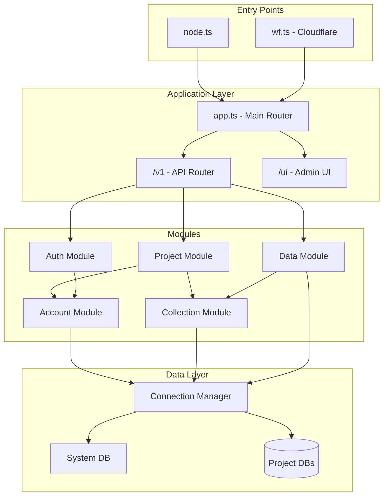
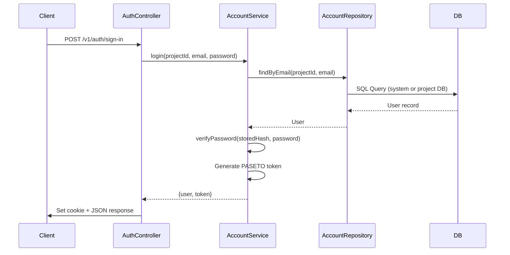
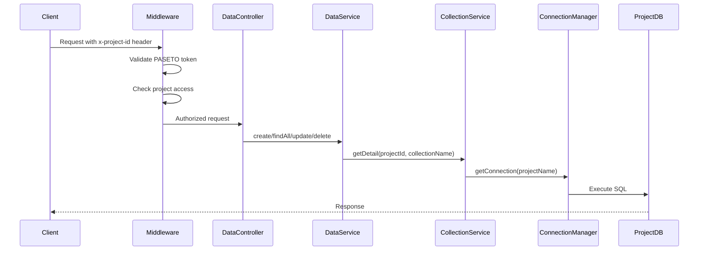

# Santoki 프로젝트 분석 보고서 (INSPECTION)

## 1. 프로젝트 개요

**Santoki**는 멀티테넌트 BaaS(Backend-as-a-Service) 스타일의 API 서버입니다. 관리자가 프로젝트를 생성하고, 각 프로젝트는 독립된 데이터베이스(또는 스키마)를 가지며, 동적으로 컬렉션(테이블)을 생성/관리할 수 있는 구조입니다.

### 기술 스택

| 영역 | 기술 |
|------|------|
| Web Framework | [Hono](https://hono.dev) |
| Database ORM | [Drizzle ORM](https://orm.drizzle.team) + PostgreSQL |
| 인증 | PASETO v3 (Local Encryption) |
| 비밀번호 해싱 | scrypt (Node.js crypto) |
| Validation | Zod |
| 테스트 | Vitest + Testcontainers |
| 배포 타겟 | Node.js / Cloudflare Workers |

---

## 2. 전체 아키텍처



---

## 3. 핵심 로직 흐름

### 3.1 인증 흐름 (Authentication Flow)



### 3.2 데이터 액세스 흐름 (Multi-tenant Data Access)



### 3.3 프로젝트 생성 흐름

1. **POST /v1/projects** → `projectService.create()`
2. 시스템 DB에 프로젝트 메타데이터 저장
3. `initializeDataSource()` → 대상 DB에 `accounts` 테이블 자동 생성
4. 이후 해당 프로젝트에서 컬렉션 및 사용자 관리 가능

---

## 4. 디렉토리 구조

```
src/
├── apps/
│   └── app.ts              # 메인 라우터 (전역 에러 핸들링, 미들웨어 조합)
├── config/
│   └── index.ts            # 환경 설정 (DB URL, PASETO 키, 포트 등)
├── constants.ts            # 프로젝트 전역 상수
├── validators.ts           # Zod 스키마 정의
├── db/
│   ├── index.ts            # 시스템 DB 초기화 (Lazy Proxy)
│   ├── schema.ts           # Drizzle 스키마 (projects, accounts)
│   └── connection-manager.ts # 멀티테넌트 DB 연결 풀 관리
├── lib/
│   ├── errors.ts           # AppError 클래스, DB 에러 핸들링
│   ├── password.ts         # scrypt 기반 해싱/검증
│   └── initial-setup.ts    # 서버 시작 시 기본 관리자 생성
├── modules/
│   ├── auth/               # 인증 (로그인, 회원가입, 세션)
│   ├── account/            # 사용자 관리 (CRUD, 멀티테넌트)
│   ├── project/            # 프로젝트 관리
│   ├── collection/         # 동적 스키마 관리 (DDL)
│   ├── data/               # 동적 데이터 CRUD
│   └── ui/                 # 관리자 UI
├── entrypoints/
│   ├── node.ts             # Node.js 서버 진입점
│   └── wf.ts               # Cloudflare Workers 진입점
└── tests/
    ├── db-setup.ts         # Testcontainers 설정
    └── test-utils.ts       # 테스트 헬퍼 함수
```

---

## 5. 보안 문제점 🔒

> [!CAUTION]
> 아래 항목들은 **프로덕션 배포 전 반드시 해결해야 하는 심각한 보안 취약점**입니다.

### 5.1 SQL Injection 취약점 (Critical)

**위치**: `account.repository.ts`, `collection.repository.ts`, `data.service.ts`

```typescript
// account.repository.ts:65 - 취약한 코드
const result = await db.execute(sql.raw(
  `SELECT * FROM "accounts" WHERE email = '${email.replace(/'/g, "''")}'`
))
```

**문제**: 단순 작은따옴표 이스케이프만으로는 SQL Injection을 완전히 방어할 수 없습니다.

**해결 방안**:
```typescript
// Parameterized query 사용
const result = await db.execute(
  sql`SELECT * FROM "accounts" WHERE email = ${email}`
)
```

### 5.2 하드코딩된 기본 시크릿 (High)

**위치**: [config/index.ts](file:///Users/cookie.shake/workspace/santoki/src/config/index.ts#L8)

```typescript
pasetoKey: process.env.PASETO_KEY || '707172...',  // 하드코딩된 키
initialAdmin: {
  password: process.env.INITIAL_ADMIN_PASSWORD || 'password123',  // 취약한 기본값
}
```

**해결 방안**:
- 환경 변수 미설정 시 서버 시작 거부
- 기본값 제거 및 필수 환경 변수로 지정

### 5.3 불충분한 인가(Authorization) 체계 (High)

**위치**: [app.ts:84-96](file:///Users/cookie.shake/workspace/santoki/src/apps/app.ts#L84-L96)

```typescript
// TODO: Implement proper project-level permissions if needed.
// For now, if logged in, you can access.
if (!user) {
    return c.json({ error: "Unauthorized" }, 401);
}
```

**문제**: 인증된 사용자라면 **모든 프로젝트의 데이터에 접근 가능**

**해결 방안**:
- 프로젝트 멤버십 테이블 추가
- 역할 기반 접근 제어(RBAC) 구현
- 리소스 소유권 검증

### 5.4 민감 정보 로깅 (Medium)

**위치**: [auth.controller.ts:54](file:///Users/cookie.shake/workspace/santoki/src/modules/auth/auth.controller.ts#L54)

```typescript
console.error(error);  // 스택 트레이스에 민감정보 포함 가능
```

**해결 방안**: 구조화된 로깅 라이브러리 사용 (예: Pino), 민감정보 마스킹

### 5.5 응답에 토큰 노출 (Medium)

**위치**: [auth.controller.ts:50](file:///Users/cookie.shake/workspace/santoki/src/modules/auth/auth.controller.ts#L50)

```typescript
return c.json({
    user: {...},
    token: token,  // 응답 본문에 토큰 포함
})
```

**해결 방안**: 쿠키만으로 토큰 전달, 응답 본문에서 토큰 제거 권장

---

## 6. 구조적 문제점 🏗️

> [!WARNING]
> 아래 항목들은 유지보수성과 확장성에 영향을 미치는 구조적 문제입니다.

### 6.1 타입 안전성 부재

**문제**: `any` 타입의 광범위한 사용

```typescript
// account.repository.ts
create: async (projectId: number | string, data: any) => { ... }

// auth.middleware.ts
user: any;
jwtPayload: any;
```

**영향**: 런타임 에러 발생 가능성 증가, 리팩토링 어려움

### 6.2 의존성 순환 가능성

**문제**: 모듈 간 직접 import로 인한 결합도 증가

```
data.service.ts → collection.service.ts → project.repository.ts
                                       ↘ connection-manager.ts
account.repository.ts → project.repository.ts → (same deps)
```

**해결 방안**: 의존성 주입(DI) 컨테이너 도입 고려

### 6.3 중복된 스키마 정의

**문제**: `accounts` 테이블이 두 곳에서 정의됨

- [db/schema.ts](file:///Users/cookie.shake/workspace/santoki/src/db/schema.ts#L19-L28)
- [data.service.ts:93-101](file:///Users/cookie.shake/workspace/santoki/src/modules/data/data.service.ts#L93-L101) (로컬 재정의)

**해결 방안**: 단일 소스 원칙 적용

### 6.4 에러 처리 일관성 부족

**문제**: 모듈마다 다른 에러 응답 형식

```typescript
// auth.controller.ts
return c.json({ message: "...", details: "..." }, 401)

// app.ts
return c.json({ error: "...", code: "...", details: "..." }, 400)
```

**해결 방안**: 통일된 에러 응답 스키마 및 에러 팩토리 패턴 적용

### 6.5 테스트 유틸리티 문제

**위치**: [test-utils.ts:46-63](file:///Users/cookie.shake/workspace/santoki/src/tests/test-utils.ts#L46-L63)

```typescript
export async function createAdminAndLogin(app: Hono<any, any, any>) {
    // 일반 사용자로 등록 후 로그인 - 실제 admin 역할이 없음
    await request(app, '/v1/auth/register', {...})
}
```

**문제**: 함수명은 "Admin" 생성이지만 실제로는 일반 사용자 생성

---

## 7. 개발 효율성 개선 방안 🚀

### 7.1 즉시 적용 가능한 개선사항

| 우선순위 | 항목 | 예상 공수 | 효과 |
|:--------:|------|:---------:|:----:|
| 🔴 | Parameterized Query 적용 | 2-3시간 | 보안 |
| 🔴 | 환경 변수 필수화 | 30분 | 보안 |
| 🟡 | 타입 정의 파일 생성 | 4-6시간 | DX |
| 🟡 | 에러 응답 통일 | 2-3시간 | 유지보수 |
| 🟢 | ESLint/Prettier 설정 | 1시간 | 코드 품질 |

### 7.2 중기 개선 방안

#### 7.2.1 프로젝트 레벨 인가 시스템

```typescript
// 제안: project_members 테이블 추가
export const projectMembers = pgTable('project_members', {
    id: serial('id').primaryKey(),
    projectId: integer('project_id').references(() => projects.id),
    userId: text('user_id').references(() => accounts.id),
    role: text('role').notNull().default('member'),  // 'admin' | 'member' | 'viewer'
    createdAt: timestamp('created_at').defaultNow(),
})
```

#### 7.2.2 Query Builder 추상화

```typescript
// 현재: 직접 SQL 문자열 조합
const query = `INSERT INTO "${tableName}" (${cols}) VALUES (${vals})`

// 제안: 타입 안전 빌더
class DynamicQueryBuilder {
    insert(table: string, data: Record<string, unknown>): SafeQuery
    select(table: string, where?: Condition[]): SafeQuery
    // ...
}
```

#### 7.2.3 API 문서 자동화

```typescript
// @hono/zod-openapi 사용 예시
import { createRoute, OpenAPIHono } from '@hono/zod-openapi'

const route = createRoute({
    method: 'post',
    path: '/auth/sign-in',
    request: { body: { content: { 'application/json': { schema: LoginSchema }}}},
    responses: { 200: { description: 'Success', content: {...} }},
})
```

### 7.3 장기 개선 방안

#### 7.3.1 마이그레이션 시스템 강화

현재는 `drizzle-kit push`로 스키마를 적용하지만, 프로덕션 환경에서는:

- 버전 관리된 마이그레이션 파일
- 롤백 지원
- 동적 컬렉션에 대한 마이그레이션 로깅

#### 7.3.2 모니터링 및 로깅

```typescript
// 추천 스택
{
  logging: 'Pino + Pino-pretty',
  metrics: 'Prometheus + node-exporter',
  tracing: 'OpenTelemetry',
  apm: 'Sentry (에러 트래킹)'
}
```

#### 7.3.3 Rate Limiting

```typescript
import { rateLimiter } from 'hono-rate-limiter'

app.use('/v1/auth/*', rateLimiter({
    windowMs: 15 * 60 * 1000,  // 15분
    max: 5,                     // 최대 5회 시도
    keyGenerator: (c) => c.req.header('cf-connecting-ip') || 'unknown'
}))
```

---

## 8. 테스트 현황

### 8.1 현재 테스트 구조

```
src/modules/
├── account/
│   ├── account.admin.e2e-spec.ts   # Admin 계정 E2E 테스트
│   ├── account.admin.spec.ts       # Admin 단위 테스트
│   ├── account.auth.e2e-spec.ts    # 인증 E2E 테스트
│   ├── account.e2e-spec.ts         # 계정 E2E 테스트
│   └── account.spec.ts             # 계정 단위 테스트
├── collection/
│   ├── collection.spec.ts          # 컬렉션 단위 테스트
│   └── collection_e2e.spec.ts      # 컬렉션 E2E 테스트
├── data/
│   └── data.e2e-spec.ts            # 데이터 CRUD E2E 테스트
└── project/
    ├── project.e2e-spec.ts         # 프로젝트 E2E 테스트
    └── project.spec.ts             # 프로젝트 단위 테스트
```

### 8.2 테스트 커버리지 개선이 필요한 영역

- [ ] auth.middleware.ts - 단위 테스트 없음
- [ ] auth.controller.ts - 엣지 케이스 테스트
- [ ] connection-manager.ts - 연결 풀 관리 테스트
- [ ] 보안 취약점 테스트 (SQL Injection 방어 검증)

---

## 9. 개선 우선순위 요약

### 🔴 Critical (즉시)
1. SQL Injection 취약점 수정
2. 하드코딩된 시크릿 제거
3. 프로젝트 레벨 인가 구현

### 🟡 High (1-2주 내)
4. 타입 시스템 강화 (`any` 제거)
5. 에러 응답 스키마 통일
6. 로깅 시스템 개선

### 🟢 Medium (1개월 내)
7. API 문서화 (OpenAPI)
8. Rate Limiting 추가
9. 테스트 커버리지 확대

### 🔵 Low (장기)
10. DI 컨테이너 도입
11. 마이그레이션 시스템 강화
12. 모니터링 인프라 구축

---

## 10. 결론

Santoki는 멀티테넌트 BaaS로서의 기본 골격이 잘 갖춰져 있으며, PASETO 기반 인증, Drizzle ORM, 동적 스키마 관리 등 현대적인 기술 스택을 사용하고 있습니다.

그러나 **보안 취약점(특히 SQL Injection)**과 **인가 체계 부재**는 프로덕션 배포 전 반드시 해결해야 합니다. 또한 타입 안전성 강화와 에러 처리 일관성 개선을 통해 장기적인 유지보수성을 확보할 수 있습니다.

제안된 개선사항들을 우선순위에 따라 적용하면, 보다 안전하고 확장 가능한 서비스로 발전할 수 있을 것입니다.
